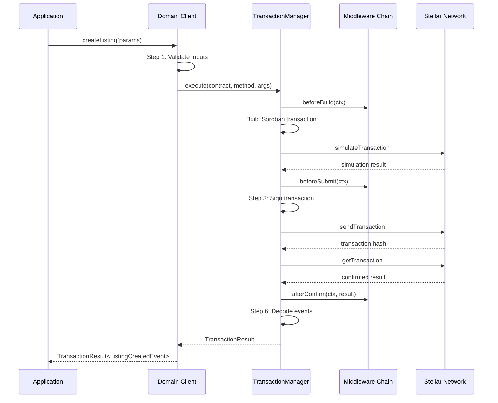

# Transaction Flow

> **Migration Notice:** This document describes the target Stellar/Soroban transaction flow. The current implementation uses ethers.js v6 as the legacy reference.

## Table of Contents

- [Pipeline Overview](#pipeline-overview)
- [Step 1: Input Validation](#step-1-input-validation)
- [Step 2: Transaction Simulation](#step-2-transaction-simulation)
- [Step 3: Transaction Signing](#step-3-transaction-signing)
- [Step 4: Transaction Submission](#step-4-transaction-submission)
- [Step 5: Confirmation](#step-5-confirmation)
- [Step 6: Result Assembly](#step-6-result-assembly)
- [Transaction Defaults](#transaction-defaults)
- [Error Recovery](#error-recovery)

---

## Pipeline Overview

Every write operation follows a six-step pipeline:



---

## Step 1: Input Validation

The domain client validates all inputs before any RPC call.

### Validation Rules

| Input Type | Rule | Error |
|-----------|------|-------|
| Stellar address | Valid StrKey format (G... or C...) | `INVALID_ADDRESS` |
| Required amount | > 0 | `INVALID_AMOUNT` |
| Price | > 0 | `INVALID_PRICE` |
| Metadata URI | Non-empty string, length >= 5 | `INVALID_METADATA_URI` |
| Entity ID | > 0 (0 is reserved as "not found") | `LISTING_NOT_FOUND` / etc. |

---

## Step 2: Transaction Simulation

Before submission, the SDK simulates the transaction via `simulateTransaction`:

```typescript
const simulation = await server.simulateTransaction(tx);
```

If simulation fails, a `ContractError` with the decoded error is thrown. No fees are spent.

---

## Step 3: Transaction Signing

The transaction is signed using the configured keypair or wallet adapter:

```typescript
tx.sign(keypair);
```

---

## Step 4: Transaction Submission

The signed transaction is submitted via `sendTransaction`:

```typescript
const sendResult = await server.sendTransaction(tx);
```

---

## Step 5: Confirmation

The SDK polls `getTransaction` until the transaction is confirmed or fails:

```typescript
const result = await server.getTransaction(txHash);
```

### Default Behavior

- **Timeout:** 120,000ms (2 minutes)
- **Polling interval:** Uses server defaults

---

## Step 6: Result Assembly

The `TransactionResult<T>` is constructed from the confirmed transaction and decoded Soroban events.

---

## Transaction Defaults

Configurable default parameters:

```typescript
interface TransactionDefaults {
  /** Timeout in ms (default: 120000) */
  timeout?: number;

  /** Whether to simulate before submission (default: true) */
  simulate?: boolean;

  /** Resource fee limit override */
  resourceFeeLimit?: bigint;
}
```

---

## Error Recovery

### TX Failed On-Chain

If the transaction fails:

1. The `TransactionManager` extracts the error from the transaction result
2. The error is decoded and wrapped in a `ContractError`

### TX Timeout

If the transaction is not confirmed within the timeout:

1. A `TransactionError` with code `CONFIRMATION_TIMEOUT` is thrown
2. The `txHash` is included for manual inspection
